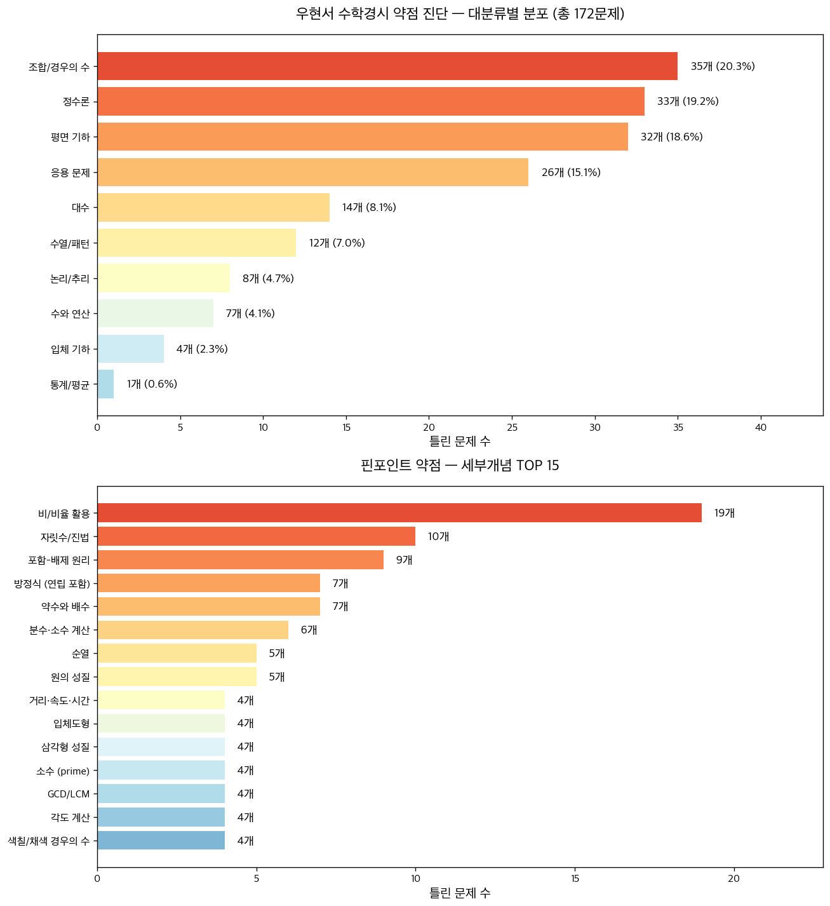

# 📊 우현서 수학경시 약점 진단 리포트

**총 분석 문제 수:** 172개 (progress.json 틀린 문제 + 31. Mock 전체)
**생성 날짜:** 2026-05-25

---

## 🎯 핵심 약점 TOP 5 (우선 학습 추천)

### 1. **비/비율 활용** — 19문제
- **왜 중요:** 경시대회 단골 응용 유형. 비/비례식이 안 잡히면 응용 문제 전반에서 무너짐.
- **학습법:** 비례식의 외항·내항 곱 활용, "전체-부분" 비례, 가비의 리 (a:b = c:d → (a±c):(b±d)) 연습. 매일 5문제씩 2주.
- **자료 추천:** 쎈수학 6학년 비와 비율 단원 / EBS 만점왕 수학 6-1 비와 비례
- **해당 문제 (대표 5개):**
  - `02. NM 2010/20.png`
  - `02. NM 2010/25.png`
  - `31. Mock/1_26.png`
  - `31. Mock/2_4.png`
  - `31. Mock/2_25.png`
  - … 외 14개

### 2. **자릿수/진법** — 10문제
- **왜 중요:** "각 자리 숫자"를 변수로 두는 발상이 핵심. 한번 익히면 자릿수 문제 전반 해결.
- **학습법:** 3자리 수 = 100a+10b+c로 쓰는 연습부터. 자리 바꿈 문제 (예: abc ↔ cba 차이 = 99(c-a)) 패턴화.
- **자료 추천:** 경시 수학 정수론 단원 / KMO 초등부 자릿수 문제집
- **해당 문제 (대표 5개):**
  - `31. Mock/1_12.png`
  - `31. Mock/2_23.png`
  - `31. Mock/2_31.png`
  - `31. Mock/5_25.png`
  - `51. RI 2021/14.png`
  - … 외 5개

### 3. **포함-배제 원리** — 9문제
- **왜 중요:** 집합 두/세 개 합집합 계산은 조합 문제의 기초.
- **학습법:** |A∪B| = |A|+|B|-|A∩B|, 세 집합 공식까지 외우기. 벤다이어그램으로 시각화 습관.
- **자료 추천:** 경시 수학 조합론 입문 / 영재고 대비 집합 단원
- **해당 문제 (대표 5개):**
  - `01. NM 2008/03.png`
  - `01. NM 2008/08.png`
  - `02. NM 2010/14.png`
  - `31. Mock/2_8.png`
  - `31. Mock/4_16.png`
  - … 외 4개

### 4. **방정식 (연립 포함)** — 7문제
- **왜 중요:** 문장제를 식으로 옮기는 능력 부족 신호. 변수 설정이 가장 큰 장벽.
- **학습법:** "무엇을 모르는지" 명확히 → 변수 1~2개 설정 → 조건 = 식 세우기. 연립방정식 가감법·대입법 숙달.
- **자료 추천:** 중1 일차방정식 단원 / 디딤돌 응용 수학 문장제
- **해당 문제 (대표 5개):**
  - `01. NM 2008/16.png`
  - `31. Mock/2_18.png`
  - `31. Mock/4_25.png`
  - `31. Mock/4_3.png`
  - `54. RI 2024/03.png`
  - … 외 2개

### 5. **약수와 배수** — 7문제
- **왜 중요:** 정수론 기초 토대. 약수의 개수 공식, GCD/LCM 관계를 자동으로 떠올려야 함.
- **학습법:** 약수 개수 = (지수+1)들의 곱 외우기. GCD × LCM = 두 수의 곱 활용. 소인수분해 매일 3문제.
- **자료 추천:** 쎈수학 6학년 약수와 배수 / 경시 정수론 입문
- **해당 문제 (대표 5개):**
  - `02. NM 2010/23.png`
  - `31. Mock/2_24.png`
  - `31. Mock/4_29.png`
  - `53. RI 2023/10.png`
  - `54. RI 2024/16.png`
  - … 외 2개

---

## 📈 대분류별 약점 분포

| 영역 | 문제 수 | 비율 | 세부개념 TOP 3 |
|---|---:|---:|---|
| 조합/경우의 수 | 35 | 20.3% | 포함-배제 원리 (8), 순열 (5), 색칠/채색 경우의 수 (4) |
| 정수론 | 33 | 19.2% | 약수와 배수 (6), 자릿수/진법 (4), 소수 (prime) (4) |
| 평면 기하 | 32 | 18.6% | 비/비율 활용 (10), 삼각형 성질 (3), 넓이 분할 (3) |
| 응용 문제 | 26 | 15.1% | 비/비율 활용 (7), 거리·속도·시간 (4), 일률 (함께 일하기) (3) |
| 대수 | 14 | 8.1% | 방정식 (연립 포함) (7), 최적화 (1), 식 조작 (1) |
| 수열/패턴 | 12 | 7.0% | 자릿수/진법 (2), 자릿수 패턴 (2), 분수·소수 계산 (2) |
| 논리/추리 | 8 | 4.7% | 논리 추리 (2), 마방진 (2), 역추적 (1) |
| 수와 연산 | 7 | 4.1% | 분수·소수 계산 (3), 자릿수/진법 (2), 단위 환산 및 나눗셈 (1) |
| 입체 기하 | 4 | 2.3% | 입체도형 (4) |
| 통계/평균 | 1 | 0.6% | 평균과 총합 (1) |

---

## 🔍 핀포인트 약점 — 세부개념 전체 (빈도순)

| 순위 | 세부개념 | 빈도 |
|---:|---|---:|
| 1 | 비/비율 활용 | 19 |
| 2 | 자릿수/진법 | 10 |
| 3 | 포함-배제 원리 | 9 |
| 4 | 방정식 (연립 포함) | 7 |
| 5 | 약수와 배수 | 7 |
| 6 | 분수·소수 계산 | 6 |
| 7 | 순열 | 5 |
| 8 | 원의 성질 | 5 |
| 9 | 거리·속도·시간 | 4 |
| 10 | 입체도형 | 4 |
| 11 | 삼각형 성질 | 4 |
| 12 | 소수 (prime) | 4 |
| 13 | GCD/LCM | 4 |
| 14 | 각도 계산 | 4 |
| 15 | 색칠/채색 경우의 수 | 4 |
| 16 | 백분율 | 3 |
| 17 | 자릿수 합 (9의 배수 판정) | 3 |
| 18 | 넓이 분할 | 3 |
| 19 | 일률 (함께 일하기) | 3 |
| 20 | 논리 추리 | 2 |
| 21 | 점화식·수열 규칙 | 2 |
| 22 | 마방진 | 2 |
| 23 | 영국 깃발 정리 | 2 |
| 24 | 비둘기집 원리 | 2 |
| 25 | 나머지 (모듈러) | 2 |
| 26 | 사각형 성질 | 2 |
| 27 | 정수 분할 (별과 막대) | 2 |
| 28 | 자릿수 패턴 | 2 |
| 29 | 격자 경로 수 | 2 |
| 30 | 약수의 개수 | 2 |
| 31 | 단위 환산 및 나눗셈 | 1 |
| 32 | 손익 계산 | 1 |
| 33 | 정수론 | 1 |
| 34 | 막대기와 별 | 1 |
| 35 | 수열 그룹 | 1 |
| 36 | 피타고라스/삼각형 | 1 |
| 37 | 유속·배 속도 | 1 |
| 38 | 최적화 | 1 |
| 39 | 둘레 계산 | 1 |
| 40 | 거리·속도·시간 (에스컬레이터) | 1 |
| 41 | 주기성 | 1 |
| 42 | 팩토리얼 소인수 | 1 |
| 43 | 역추적 | 1 |
| 44 | 곱셈 마방진 | 1 |
| 45 | 평균과 총합 | 1 |
| 46 | 거리·속도·시간 (기차) | 1 |
| 47 | 참/거짓 진술 + 수론 조건 | 1 |
| 48 | 조합 (C(n,k)) | 1 |
| 49 | 닮음비 활용 | 1 |
| 50 | 피보나치 생성함수형 합 | 1 |
| 51 | 식 조작 | 1 |
| 52 | 왕복 만남 | 1 |
| 53 | 동전 문제 | 1 |
| 54 | 스도쿠형 영역합 | 1 |
| 55 | 조합 + 일직선 제외 | 1 |
| 56 | 격자 위 3점 일직선 세기 | 1 |
| 57 | 식 인수분해 | 1 |
| 58 | 제곱차 인수분해 | 1 |
| 59 | 팩토리얼의 끝자리 0 | 1 |
| 60 | 분배법칙 | 1 |
| 61 | 엄격 증가 분할 | 1 |
| 62 | 소수와 합성수 조건 | 1 |
| 63 | 농도 | 1 |
| 64 | 요일 계산 | 1 |
| 65 | 서로소 | 1 |
| 66 | 소인수 합 | 1 |
| 67 | 선형결합 | 1 |
| 68 | 좌표기하 | 1 |
| 69 | 조건부 쌍 세기 | 1 |
| 70 | 삼각수 행 배열 | 1 |
| 71 | 경우의 수 (일반) | 1 |
| 72 | Burnside 보조정리 | 1 |

---

## 📚 영역별 문제 상세 목록

### 조합/경우의 수 (35문제)

- `60. AP 2025/26.png` — *Burnside 보조정리* — 2×3 흑백 카드 대칭 동치류 수
- `51. RI 2021/18.png` — *격자 경로 수* — 8-0에서 11-8까지 A 승리로 가는 경로 수
- `54. RI 2024/13.png` — *격자 위 3점 일직선 세기* — 삼각형 점 배열에서 3점 지나는 선분 개수
- `60. AP 2025/25.png` — *경우의 수 (일반)* — 4자리수 중 정확히 한 쌍의 같은 숫자
- `53. RI 2023/16.png` — *동전 문제* — 3,4,6점 문제로 만들 수 없는 점수의 합
- `31. Mock/1_14.png` — *막대기와 별* — 구슬 28개를 3상자에 빈 상자 없이 분배
- `31. Mock/4_32.png` — *비둘기집 원리* — 1~13 카드에서 두 카드 쌍합이 모두 다른 최대 카드 수
- `31. Mock/5_30.png` — *비둘기집 원리* — 5색 구슬 2개씩 뽑을 때 같은 조합 2명 보장 최소 인원
- `60. AP 2025/28.png` — *삼각형 성질* — 정12각형 3점 선택 시 둔각삼각형 개수
- `31. Mock/4_35.png` — *색칠/채색 경우의 수* — 11개 육각형 칸 4색으로 인접 다르게 칠하는 경우의 수
- `31. Mock/5_33.png` — *색칠/채색 경우의 수* — 3×5 격자 9칸 검정칠, 각 행·열 홀수 검정 경우의 수
- `52. RI 2022/17.png` — *색칠/채색 경우의 수* — 3×3 격자 홀짝 인접 배치 경우의 수
- `60. AP 2025/20.png` — *색칠/채색 경우의 수* — 8개 영역 인접 다르게 4색 칠하기 수
- `01. NM 2008/09.png` — *순열* — 8개 문에서 들어오고 나가는 경우의 수
- `31. Mock/4_27.png` — *순열* — hello 글자 잘못 배열하는 방법의 수
- `31. Mock/5_16.png` — *순열* — 6명 한 줄, Jack-Tony-Andy 인접 조건의 배열 수
- `56. AP 2021/06.png` — *순열* — 계단 모양 보드에 5개 돌 배치 (행·열 각1)
- `56. AP 2021/23.png` — *순열* — 디지트 2,3,4,5의 교란 순열 수
- `60. AP 2025/29.png` — *약수와 배수* — 5×5격자 직사각형 중 내부 합이 5배수
- `56. AP 2021/12.png` — *엄격 증가 분할* — 6일간 매일 증가하며 25문제 푸는 분할 수
- `55. RMO 2025/12.png` — *자릿수/진법* — 3자리 수에서 십의 자리가 나머지 두 자리 평균
- `31. Mock/1_25.png` — *점화식·수열 규칙* — 2×8 사각형을 2×1로 덮는 방법 수
- `31. Mock/5_23.png` — *정수 분할 (별과 막대)* — 30개를 4묶음에 n번째에 최소 n개 조건으로 분배
- `53. RI 2023/17.png` — *정수 분할 (별과 막대)* — 사과 23, 오렌지 18을 5상점에 최소 조건 만족 분배 수
- `60. AP 2025/22.png` — *조건부 쌍 세기* — 각각 25%이상, 25~28 포함 조건의 정수쌍
- `51. RI 2021/09.png` — *조합 (C(n,k))* — 자릿수 감소하는 3자리 짝수의 개수
- `54. RI 2024/06.png` — *조합 + 일직선 제외* — 원 위 등간격 12점에서 회전·반사 동일 삼각형 수
- `01. NM 2008/08.png` — *포함-배제 원리* — 나비넥타이/안경 안 한 사람 최대값
- `02. NM 2010/14.png` — *포함-배제 원리* — 수학·영어 등급 비교 학생 수
- `31. Mock/2_8.png` — *포함-배제 원리* — 바이올린·전자피아노 합집합 인원
- `31. Mock/4_16.png` — *포함-배제 원리* — 흰/검 상의·검/파 하의 60명 검상의·검하의
- `31. Mock/5_22.png` — *포함-배제 원리* — 1~500 중 2,3,7 어느 것으로도 나뉘지 않는 수의 개수
- `53. RI 2023/13.png` — *포함-배제 원리* — 46명 중 4종 스포츠 모두 가능한 최소 인원
- `56. AP 2021/19.png` — *포함-배제 원리* — 이웃이 색·숫자 모두 다른 6장 배열 수
- `56. AP 2021/21.png` — *포함-배제 원리* — SMOPS·HCIC 참가자 집합 활용

### 정수론 (33문제)

- `31. Mock/2_21.png` — *GCD/LCM* — A+B=2024, LCM=3795일 때 큰 값
- `51. RI 2021/20.png` — *GCD/LCM* — n명 원형 게임, 자기 외 모두 받는 라운드 보장 최소 n
- `54. RI 2024/09.png` — *GCD/LCM* — [1,2,...,n]/n! 의 서로 다른 값의 개수
- `56. AP 2021/07.png` — *GCD/LCM* — 4개의 서로 다른 자연수 합 1111의 최대 공약수
- `31. Mock/4_26.png` — *곱셈 마방진* — 1225의 9개 약수로 곱셈 마방진의 중앙값 구하기
- `31. Mock/4_33.png` — *나머지 (모듈러)* — 2^2020, 3^2020을 100으로 나눈 나머지 차이 계산
- `60. AP 2025/05.png` — *서로소* — 직전 특수수 합과 서로소인 20번째 특수수
- `31. Mock/1_19.png` — *소수 (prime)* — 3P+7Q=335, P+Q가 제곱수일 때 Q-P
- `53. RI 2023/09.png` — *소수 (prime)* — ab^c c^d+a=2023, a,b,c,d 서로 다른 소수→ab+bc+cd+da
- `55. RMO 2025/13.png` — *소수 (prime)* — 42-x-y-z 가 항상 소수가 되는 순서쌍 개수
- `56. AP 2021/17.png` — *소수 (prime)* — 4n±1 모두 합성수인 최소 n
- `60. AP 2025/02.png` — *소수와 합성수 조건* — 모든 소수 p에 대해 p²+n이 합성수인 최소 n
- `60. AP 2025/09.png` — *소인수 합* — 소인수 합이 2025인 최소 양의 정수
- `02. NM 2010/23.png` — *약수와 배수* — 세 자리수 X와 뒤집은 Y 조건 만족 X
- `31. Mock/2_24.png` — *약수와 배수* — 2012·1274 같은 나머지일 때 D-R 최댓값
- `31. Mock/4_29.png` — *약수와 배수* — 연속 세 수가 각각 4,7,9의 배수일 때 최소 합
- `53. RI 2023/10.png` — *약수와 배수* — n학생 k일 점수 1~n 매일 합 같음, k|n, 누적 40점→n
- `54. RI 2024/16.png` — *약수와 배수* — 2024 = n개 연속 자연수 합, n 최대
- `56. AP 2021/26.png` — *약수와 배수* — 2021~8999 자릿수 합이 7의 배수인 수
- `52. RI 2022/11.png` — *약수의 개수* — 라벨 1~1000 캔디 증감 후 20개 넘는 학생 수
- `56. AP 2021/13.png` — *약수의 개수* — 2와 7로 나뉘지만 동시 아닌 약수 수
- `60. AP 2025/04.png` — *요일 계산* — 2024년 2월 29일이 목요일 → 다음 목요 윤년
- `02. NM 2010/29.png` — *자릿수 합 (9의 배수 판정)* — 2010년 날짜 자릿수 합이 12인 일수
- `31. Mock/2_19.png` — *자릿수 합 (9의 배수 판정)* — 1~9 한번씩 써서 만든 그룹 내 소수 최대
- `31. Mock/2_35.png` — *자릿수 합 (9의 배수 판정)* — 자릿수 합 행 정렬에서 9799 위치
- `31. Mock/1_12.png` — *자릿수/진법* — 2(abcd)+1000=dcba 만족 네 자리수
- `31. Mock/2_23.png` — *자릿수/진법* — 자릿수 두 조건 만족하는 세 자리수
- `31. Mock/5_25.png` — *자릿수/진법* — 4자리 수의 첫 자리를 끝으로 옮기면 4707 커지는 최소 수
- `60. AP 2025/30.png` — *자릿수/진법* — ABCD=(AB+CD)² 조건 만족하는 4자리수 합
- `02. NM 2010/30.png` — *정수론* — 2010 NM 30번 (이미지 본문 누락)
- `31. Mock/2_32.png` — *주기성* — (2^1+1)…(2^2011+1) 마지막 두 자리
- `31. Mock/2_33.png` — *팩토리얼 소인수* — 26! 표기에서 미지수 A+B+C+D 합
- `55. RMO 2025/15.png` — *팩토리얼의 끝자리 0* — 2025!의 끝에 붙는 0의 개수

### 평면 기하 (32문제)

- `31. Mock/4_24.png` — *각도 계산* — 정사각형 6개로 만든 직사각형에서 각 ABC 구하기
- `52. RI 2022/07.png` — *각도 계산* — 두 평행사변형과 AC=AD=CF 조건에서 ∠ECD 구하기
- `54. RI 2024/20.png` — *각도 계산* — 별 도형에서 ∠C+D+E+F+G 합 구하기
- `55. RMO 2025/04.png` — *나머지 (모듈러)* — BG=EF, 90도 교차 조건에서 ∠CEF 구하기
- `31. Mock/1_16.png` — *넓이 분할* — 직사각형 내 삼각형 두 넓이로 ADOE 구하기
- `53. RI 2023/15.png` — *넓이 분할* — 변 3,5,8 정사각형 3개에서 대각선 만든 빗금 넓이
- `60. AP 2025/06.png` — *넓이 분할* — 정사각형 안 두 음영 삼각형 합 넓이
- `52. RI 2022/02.png` — *닮음비 활용* — 평행선 분할 삼각형의 평행사변형 넓이로 ABC 넓이 구하기
- `31. Mock/2_15.png` — *둘레 계산* — 작은 정사각형들로 분할된 직사각형 둘레
- `02. NM 2010/25.png` — *비/비율 활용* — 삼각형 BEF 넓이로 사각형 AEFC 넓이
- `31. Mock/1_26.png` — *비/비율 활용* — 삼각형 ABC 내부 점들로 만든 EFG 넓이
- `31. Mock/2_4.png` — *비/비율 활용* — 65, 35, 49 m² 주어진 네 직사각형 합
- `31. Mock/2_26.png` — *비/비율 활용* — DEF 넓이 7로 ABC 넓이 구하기
- `31. Mock/4_15.png` — *비/비율 활용* — ABCD 사다리꼴 내 음영 넓이
- `31. Mock/4_21.png` — *비/비율 활용* — 정육각형 각 변을 2배 연장해 만든 큰 육각형 넓이 구하기
- `53. RI 2023/18.png` — *비/비율 활용* — BD=DE=EC, CF:AC=1:3, △ADH−△EFH=12.6로 △ABC 넓이
- `54. RI 2024/11.png` — *비/비율 활용* — BD=3/7 BC, AF=FD인 삼각형 음영 넓이로 ABC 구하기
- `55. RMO 2025/03.png` — *비/비율 활용* — 정사각형 내 음영 마름모 넓이 비 구하기
- `56. AP 2021/28.png` — *비/비율 활용* — 정12각형 내 직사각형:정사각형 넓이비
- `31. Mock/4_34.png` — *사각형 성질* — BE+BF=49 조건에서 삼각형 DEF 최소 넓이
- `31. Mock/5_14.png` — *사각형 성질* — 계단 모양 절단 후 정사각형 만들 때 AB:BC 비율
- `31. Mock/1_10.png` — *삼각형 성질* — 정육각형·정오각형 결합 시 각 BAC
- `31. Mock/2_14.png` — *삼각형 성질* — 팔각형 그림 속 삼각형 총 개수
- `53. RI 2023/14.png` — *삼각형 성질* — 겹치는 넓이 578로 AF 길이 구하기
- `31. Mock/2_34.png` — *영국 깃발 정리* — 직사각형 내부 점 PA·PB·PC·PD 관계
- `31. Mock/5_31.png` — *영국 깃발 정리* — AEFG=16, △BFD=42일 때 정사각형 ABCD 넓이
- `53. RI 2023/08.png` — *원의 성질* — 정사각형 내부를 따라 원이 회전할 때 덮는 넓이
- `56. AP 2021/10.png` — *원의 성질* — 7개 단위정사각형 도형의 외접원 넓이
- `56. AP 2021/24.png` — *원의 성질* — 수직 현으로 나뉜 4영역 넓이 차
- `60. AP 2025/21.png` — *좌표기하* — 정삼각형 위 정사각형 도형의 A-B 거리
- `01. NM 2008/03.png` — *포함-배제 원리* — 두 정사각형 겹치는 영역 넓이
- `31. Mock/1_27.png` — *피타고라스/삼각형* — 직사각형 종이 접어 A=C일 때 EF 길이

### 응용 문제 (26문제)

- `31. Mock/4_18.png` — *각도 계산* — 9시 지난 후 시침·분침이 12시 방향에 대칭이 되는 시각
- `02. NM 2010/15.png` — *거리·속도·시간* — Tom·Harry 휴식 패턴 포함 만나는 시각
- `02. NM 2010/24.png` — *거리·속도·시간* — 1/3 구간 90km/h, 나머지 45km/h 평균속도
- `54. RI 2024/04.png` — *거리·속도·시간* — A 속도 15% 증가, B 12km/h 증가시 만남점 동일
- `55. RMO 2025/16.png` — *거리·속도·시간* — Alice 왕복 후 Bob과 만나는 시각
- `31. Mock/5_11.png` — *거리·속도·시간 (기차)* — 72m 급행이 108m 시내열차 추월 시간으로 시내열차 속도 구하기
- `31. Mock/2_28.png` — *거리·속도·시간 (에스컬레이터)* — 2/1보 속도와 걸음 수로 정지 시 시간
- `56. AP 2021/22.png` — *격자 경로 수* — 원형 트랙 두 사람 만남으로 둘레 구하기
- `60. AP 2025/03.png` — *농도* — 10%와 40% 알코올 혼합으로 20% 만들기
- `02. NM 2010/26.png` — *백분율* — 캐슈넛 비율 변화로 현재 캐슈넛 수
- `31. Mock/1_18.png` — *백분율* — 여학생 비율 36%→24% 변화로 여학생 수
- `31. Mock/5_8.png` — *분수·소수 계산* — Sandra·Hans·Joe 480달러 분배에서 처음 Hans의 금액
- `31. Mock/2_25.png` — *비/비율 활용* — 두 통 기름 옮긴 후 11:7, 처음 비율
- `31. Mock/4_28.png` — *비/비율 활용* — 원가 1:2:2 가격 변동 후 새로운 질량비 m:n 구하기
- `31. Mock/4_6.png` — *비/비율 활용* — 공 비율 변화에서 처음 흰공 수 구하기
- `52. RI 2022/20.png` — *비/비율 활용* — 수면 변화 전·후 자 노출 비율로 처음 수심 구하기
- `53. RI 2023/07.png` — *비/비율 활용* — 수입 4:3, 지출 11:7, 같은 저축일 때 월 수입
- `53. RI 2023/12.png` — *비/비율 활용* — B 마을→A 마을 이동 후 남자 비율 변화로 이동 인원 구하기
- `60. AP 2025/10.png` — *비/비율 활용* — S1:S2:S3:S4 비율 합치고 총원 2158명
- `02. NM 2010/21.png` — *손익 계산* — 10%/5% 할인 시 이익 차이로 원가 구하기
- `53. RI 2023/11.png` — *왕복 만남* — Alice, Bob 왕복 두 번째 만남 거리 350m로 XY 구하기
- `52. RI 2022/19.png` — *원의 성질* — 원형 트랙 두 자전거 같은/반대 방향 만남으로 둘레 구하기
- `31. Mock/1_33.png` — *유속·배 속도* — 강 만남 지점 변화로 유속 구하기
- `31. Mock/1_32.png` — *일률 (함께 일하기)* — Alex(2h)·Bob(3h) 휴식 포함 종이학 N개
- `31. Mock/2_30.png` — *일률 (함께 일하기)* — A·B·C 효율 관계로 B 단독 일수
- `52. RI 2022/15.png` — *일률 (함께 일하기)* — 물 소비량 줄이면 며칠 더 마시는 조건으로 일수 구하기

### 대수 (14문제)

- `01. NM 2008/16.png` — *방정식 (연립 포함)* — 체스 승패와 초콜릿 교환 총 경기 수
- `31. Mock/2_18.png` — *방정식 (연립 포함)* — 5/10/25센트 동전 23개 320센트, 25-5 동전 차
- `31. Mock/4_25.png` — *방정식 (연립 포함)* — 100문제, 채점 규칙 하에 50점 받기 위한 최대 정답 수
- `31. Mock/4_3.png` — *방정식 (연립 포함)* — 세 수의 합 2015과 쌍합 세 식으로 m 구하기
- `54. RI 2024/03.png` — *방정식 (연립 포함)* — x+y/z=15, y+x/z=20 로부터 (x+y)/z 구하기
- `60. AP 2025/07.png` — *방정식 (연립 포함)* — xy=10(x+y)=15(x-y) → x+y
- `60. AP 2025/24.png` — *방정식 (연립 포함)* — 넓이 동일 조건 (길이-14, 너비+8)으로 둘레
- `56. AP 2021/04.png` — *분배법칙* — 표 합 = (행합)(열합) 형태 정리
- `54. RI 2024/14.png` — *비/비율 활용* — 구슬 이동 후 비율 조건 2개로 총합 구하기
- `60. AP 2025/18.png` — *선형결합* — Wang·Li 식 결합해 56·108·52 가격 구하기
- `55. RMO 2025/09.png` — *식 인수분해* — AB-CD 형태 차이를 항 재정렬로 계산
- `53. RI 2023/03.png` — *식 조작* — 두 큰 분수합 곱의 차 계산
- `55. RMO 2025/11.png` — *제곱차 인수분해* — (홀제곱합-짝제곱합)/(홀합-짝합) 계산
- `31. Mock/1_34.png` — *최적화* — 10시간 운동·독서 분배로 기분×체력 최대

### 수열/패턴 (12문제)

- `51. RI 2021/11.png` — *분수·소수 계산* — 1/Σ43, 1/Σ(43+86)… 합의 값
- `53. RI 2023/01.png` — *분수·소수 계산* — Σ1/[k(k+1)] > 1823/2023 만족 최소 n
- `02. NM 2010/20.png` — *비/비율 활용* — Level 40 삼각형 성냥개비 개수
- `60. AP 2025/23.png` — *삼각수 행 배열* — 행 길이 늘어나는 홀수표에서 2025 바로 아래 수
- `31. Mock/1_22.png` — *수열 그룹* — 홀수 그룹에서 2023이 속한 그룹 크기
- `52. RI 2022/14.png` — *원의 성질* — 2022/(1+2+..+k) 합의 자릿수 합
- `31. Mock/5_35.png` — *자릿수 패턴* — 1~100 이어 쓴 후 3자리씩 묶었을 때 최대·최소 차이
- `55. RMO 2025/01.png` — *자릿수 패턴* — n번째 정수가 n번 반복되는 수열의 2025번째 자릿수
- `31. Mock/2_31.png` — *자릿수/진법* — 6개 세자리 등차수열 합 최솟값
- `51. RI 2021/14.png` — *자릿수/진법* — 11부터 시작 팰린드롬 나열에서 661번째 자릿수
- `54. RI 2024/02.png` — *점화식·수열 규칙* — 4,9,24,69,204,609,... 다음 두 항 합 구하기
- `52. RI 2022/05.png` — *피보나치 생성함수형 합* — 피보나치 수/5^n 무한합의 값

### 논리/추리 (8문제)

- `01. NM 2008/12.png` — *논리 추리* — Andy/Ben/Calvin 줄 서기 총 인원 추리
- `31. Mock/5_21.png` — *논리 추리* — 4명 진술 중 정확히 1명만 옳을 때 그림 수 구하기
- `31. Mock/1_29.png` — *마방진* — 3×3 마방진에서 x 구하기
- `31. Mock/2_20.png` — *마방진* — 3×3 마방진 일부 채워진 공통합 구하기
- `54. RI 2024/01.png` — *스도쿠형 영역합* — 5×5에 1~5 배치, 각 영역합 같을 때 '?' 값
- `31. Mock/4_22.png` — *역추적* — 6명이 순서대로 절반 빼고 1개 돌려놓는 사탕 문제 역산
- `60. AP 2025/27.png` — *자릿수/진법* — 여러 변환 거쳐 원래수 = 결과인 4자리수
- `31. Mock/5_34.png` — *참/거짓 진술 + 수론 조건* — 5명 진술 중 3명만 참일 때 3자리 수 찾기

### 수와 연산 (7문제)

- `01. NM 2008/02.png` — *단위 환산 및 나눗셈* — 12시간/일 작동 시 $864000 인쇄 일수 구하기
- `31. Mock/1_17.png` — *백분율* — Ian 책 읽기 마지막날 비율 (1일차 대비)
- `31. Mock/2_12.png` — *분수·소수 계산* — 1/(1/2016+..+1/2011) 정수부분
- `54. RI 2024/05.png` — *분수·소수 계산* — 1/(2²-1)+...+1/(2024²-1) 의 분자·분모 자릿수 합
- `54. RI 2024/10.png` — *분수·소수 계산* — 이중합을 재배치해 정수합 형태로 계산
- `56. AP 2021/20.png` — *자릿수/진법* — 7n이 2021자리인 최소 n의 일의 자리
- `60. AP 2025/14.png` — *자릿수/진법* — x/3과 3x가 모두 5자리 정수인 x 개수

### 입체 기하 (4문제)

- `02. NM 2010/19.png` — *입체도형* — 5개 정육면체 그림 중 다른 하나 찾기
- `31. Mock/1_15.png` — *입체도형* — 4×3×5 수조 채울 추가 1cm 큐브 수
- `51. RI 2021/19.png` — *입체도형* — 4×4×4 큐브, 페인트 묻은 작은 큐브 37개→칠한 면 수
- `56. AP 2021/30.png` — *입체도형* — 8개 칸 중 2개 제거하여 정육면체 전개도

### 통계/평균 (1문제)

- `31. Mock/4_5.png` — *평균과 총합* — 점수 정정으로 평균 0.4 변화→학생 수 구하기

---

## 💡 학습 전략 (구체적 행동 계획)

### 1주차–2주차: 비/비율 + 자릿수 집중
- 매일 30분: 비/비율 응용 5문제 (가장 큰 약점)
- 매일 15분: 자릿수 변수화 (`abc = 100a+10b+c`) 연습 3문제

### 3주차: 포함-배제 + 연립방정식
- 벤다이어그램으로 집합 시각화 → 식 세우기 습관
- 문장제 → 변수 설정 → 식 → 풀이 4단계 매일

### 4주차: 약수와 배수 + 평면 기하 (각도·닮음)
- 약수 개수 공식, GCD/LCM 곱 = 두 수의 곱 자동화
- 각도 추적: 외각/내각, 닮음비 활용 5문제

### 매주 토요일: 약점 영역 (Mock 31) 다시 풀기
- 같은 문제 2번째 시도 → "맞았어요" 확인 → 학습 효과 측정

---

## 📝 메모

- 분류는 AI 자동 태깅 결과이며 일부 오분류 있을 수 있음.
- 31. Mock 71문제는 "틀린 문제"가 아니라 "전체 시험 진단용"으로 포함됨.
- 같은 개념이라도 출제 형태(서술/객관식)에 따라 난이도 다름 — 우선순위 참고용.
